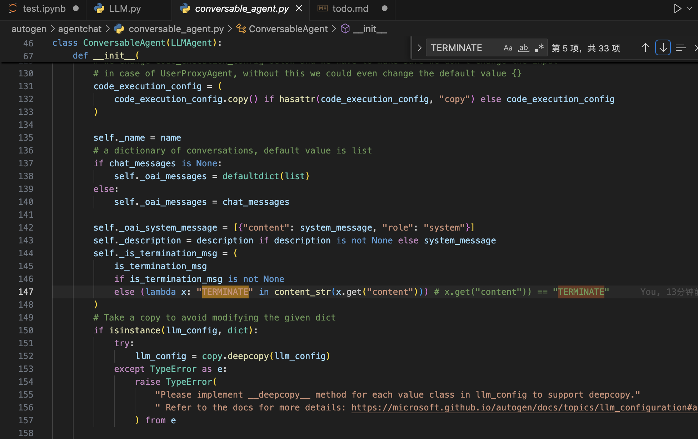
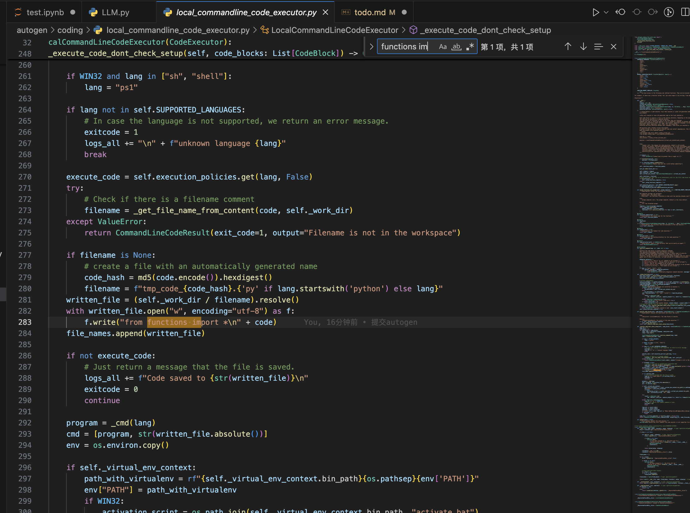

# Workflow

# ToDo
1. 完善tools函数 ✅

2. 设计选表prompt及获取选表结果function（修改TABLE_PROMPT即可）✅


3. 设计总体prompt与函数prompt，以便prompt组合（例：总+法院表+地址表+天气表）✅


4. “91310000677833266F的公司全称是？该公司的涉案次数为？（起诉日期在2020年）作为被起诉人的次数及总金额为？” 解决， 但是答案不够精简(`涉案次数：无法提供具体涉案次数，`), 金额数字可能格式有问题（`105,806.0元`,应该为`105806.0元`）

```markdown
code_writer_agent (to code_executor_agent):

根据执行成功的代码输出，我们得到了以下信息：

- 公司全称：上海晨光文具股份有限公司
- 作为被起诉人的次数：46次
- 作为被起诉人的总金额：105,806.0元

因此，上海晨光文具股份有限公司在2020年作为被起诉人的次数为46次，总涉案金额为105,806.0元。

--------------------------------------------------------------------------------
code_executor_agent (to code_writer_agent):

请继续 如果所有的事情都已经做完，请只返回'TERMINATE'。

--------------------------------------------------------------------------------
'公司全称：上海晨光文具股份有限公司\n涉案次数：无法提供具体涉案次数，但作为被起诉人的次数为46次（2020年）\n作为被起诉人的总金额：105,806.0元（2020年）'
```

5. 测试收集badcase并完善方案 进行中...✅
删除字符串中","
* 金额问题`105,806.0元`,应该为`105806.0元`
* 在民事起诉状类问题直接调用民事起诉状函数，但此时缺少其他信息(而且存在完善/更改函数输出现象)✅
通过优化prompt解决

* 有小部分问题回答失败，应该是分类时json解析问题✅
做了优化，直到解析成功，否则一直循环

* 分次回答（结果不在同一个代码块），没有总结答案

* 拿简称当全称。。。


### autogen修改记录
1. ConversableAgent第147行

2. LocalCommandLineCodeExecutor第283行

3. **把autogen文件夹放在项目文件夹，会优先走本地local autogen里的文件的**， 应该可以解决之前那个问题，（相同的包名， 先找本地local，然后再找env里的， 最后找base）