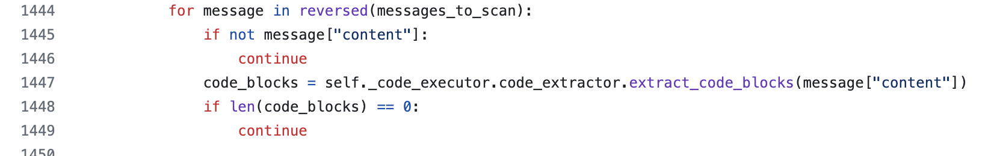
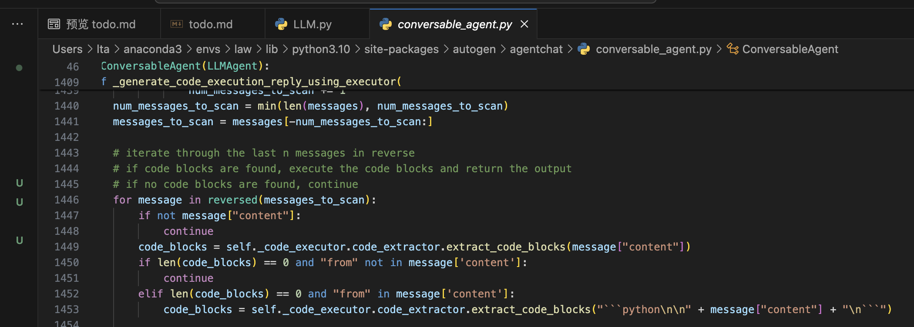
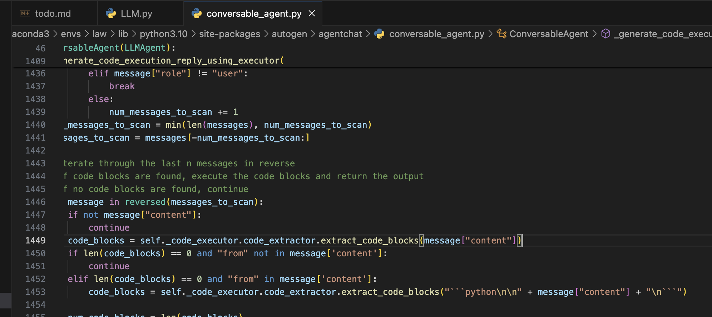

## 1. GLM在简单问题（一个函数就能解决）大概率选择正确的函数但执行tool_call 已解决

LocalCommandLineCodeExecutor 316行添加`if "print" not in code: logs_all += "代码中没有print函数，无法打印结果。\n请传入使用print打印结果的代码。"`
## 2. 返回的部分代码会不带或带一半代码框（尚未测试）

ConversableAgent 1450行
修改前

修改后

## 3. get_sub_company_info函数bug 已解决

## 4. 代码中不带from functions import 已解决
LocalCommandLineCodeExecutor 283行 加了`f.write("from functions import *\n" + code)`
## 5.未正常结束对话 待测试
比如glm应只回复TERMINATE，结果回复了print('TERMINATE')
修改前

修改后

> 目前77分answers已经上传到results
