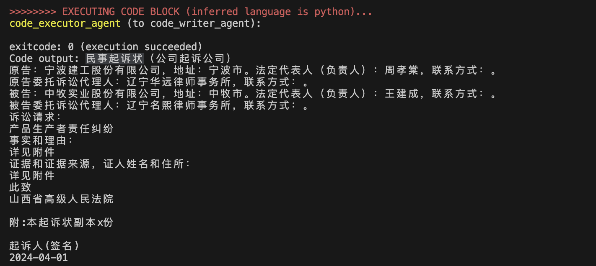
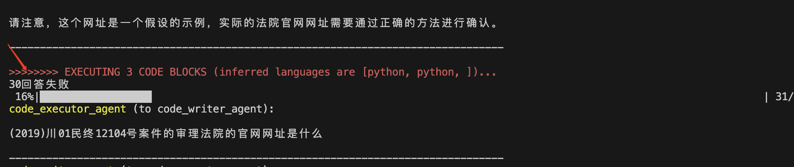
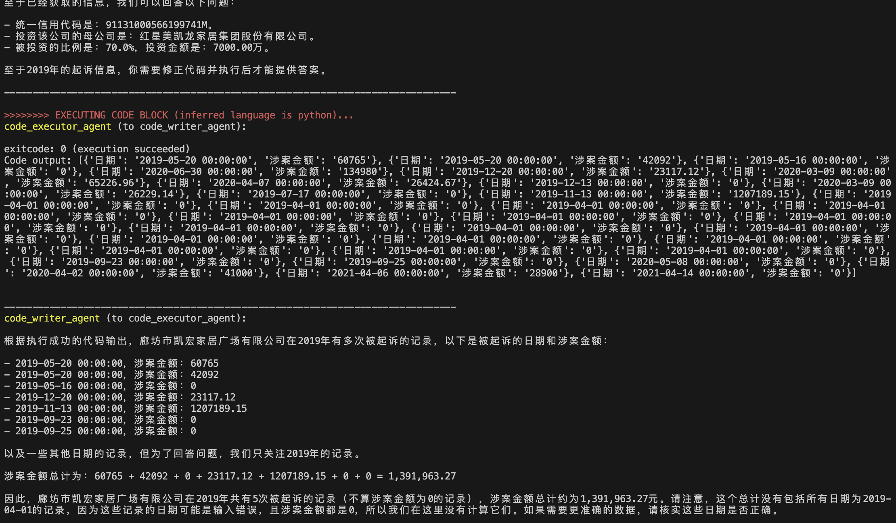

# Workflow

# ToDo
1. 完善tools函数 ✅

2. 设计选表prompt及获取选表结果function（修改TABLE_PROMPT即可）✅

3. 设计总体prompt与函数prompt，以便prompt组合（例：总+法院表+地址表+天气表）✅

4. 测试收集badcase并完善方案 进行中...
* 在民事起诉状类问题直接调用民事起诉状函数，但此时缺少其他信息(而且存在完善/更改函数输出现象)

* 有小部分问题回答失败，应该是分类时json解析问题

* 分次回答（结果不在同一个代码块），没有总结答案

* 拿简称当全称。。。
